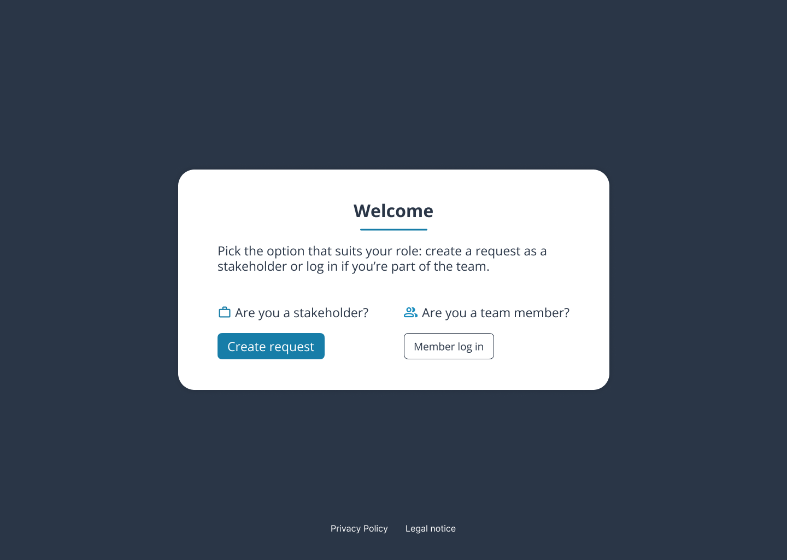
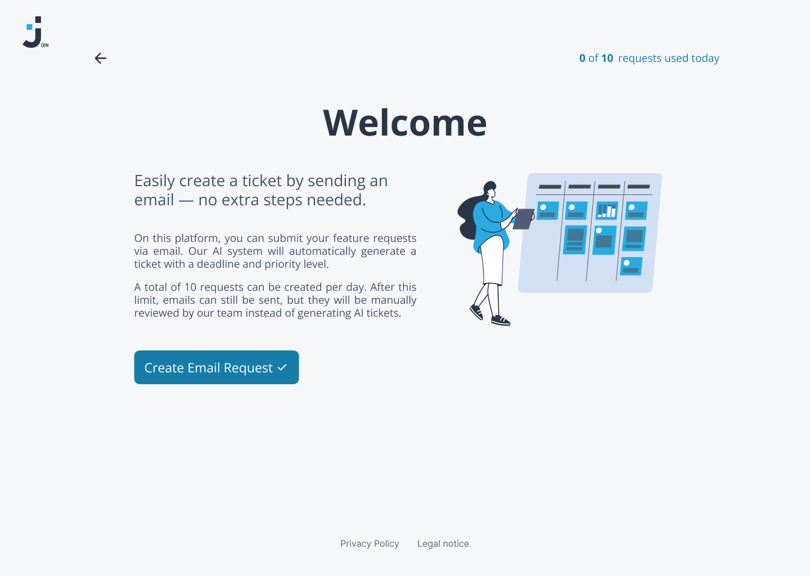
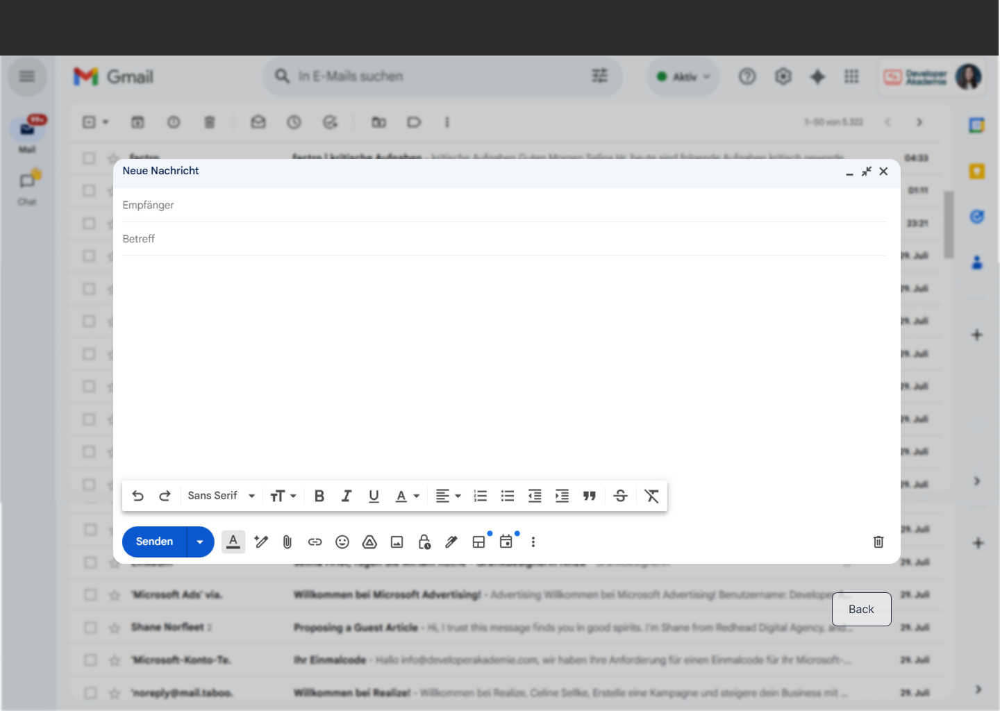
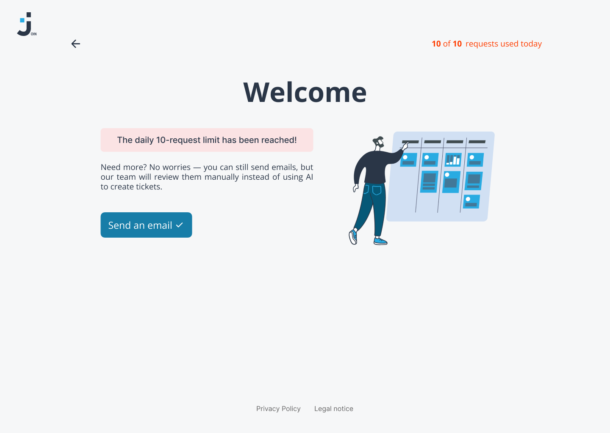

# Join AI Automation

Join is a Kanban task-management app extended with an **AI-powered email intake workflow**. Stakeholders can submit requests by email, n8n analyzes the message with Google Gemini, creates a structured Firebase ticket in **Triage**, and sends automatic confirmations or fallback notifications.

**Live demo:** https://obo-wan.github.io/Join-AI-Automation/
**Stakeholder request email:** `join@naranjo.io`

## Highlights

- Stakeholder and team-member entry flows
- Email intake through IMAP
- AI extraction of title, category, priority, deadline, and description
- Automatic Firebase ticket creation in **Triage**
- External/internal creator metadata on board cards
- Automatic status-change emails
- Daily **10-request AI cost airbag**
- Manual-review fallback when automation fails or the daily limit is reached
- Responsive desktop and mobile UI

## User Flow

1. Open the Join welcome page.
2. Choose **Create request** as a stakeholder.
3. Send the request to `join@naranjo.io`.
4. n8n reads the email and checks the daily AI request limit.
5. Gemini analyzes and structures the request.
6. A Firebase ticket is created in **Triage**.
7. The sender receives a confirmation email.
8. When the ticket changes status, the external creator receives a status update.

If the AI workflow cannot process the request, or the daily limit has already been reached, the email is routed for **manual review** instead.

## Product Screens

### Welcome



The entry screen separates the stakeholder request flow from the internal team-member login.

### Stakeholder Request



Stakeholders can see the current daily request usage and launch a pre-addressed email request.

### Email Intake



Requests are submitted by email and processed automatically by the n8n intake workflow.

### Daily Limit



After 10 AI requests in one day, additional emails are still accepted but routed to manual review instead of Gemini ticket generation.

## Automation Architecture

```text
Stakeholder email
      │
      ▼
IMAP / n8n
      │
      ▼
Daily usage check ────── limit reached ──────► manual review
      │
      ▼
Firebase atomic request counter
      │
      ▼
Google Gemini / Information Extractor
      │
      ▼
Create Firebase task
      │
      ├── failure ───────────────────────────► manual review
      │
      ▼
Triage ticket
      │
      ▼
Firebase ticketsCreated counter
      │
      ▼
Success email
```

Status changes on the board trigger a separate n8n webhook workflow that emails the ticket creator.

## AI-Generated Ticket Data

The email intake workflow creates a structured task with:

- `title`
- `description`
- `category`
- `priority`
- `dueDate`
- `status: "triage"`
- external creator name/email
- source metadata and email Message-ID
- AI-generated marker
- creation timestamp

The extractor currently classifies categories as **Technical Task**, **User Story**, or **Bug**, and priorities as **Urgent**, **Medium**, or **Low**.

## Daily Limit

The automation uses Firebase daily usage records under `automationUsage/YYYY-MM-DD`.

Two counters are kept separately:

- `count` — AI requests used for the daily cost limit
- `ticketsCreated` — successfully created tickets

Request and ticket counters use Firebase server-side atomic increments. Once `count` reaches 10, Gemini is bypassed and the email is sent to manual review.

## n8n Workflows

Exported workflows are stored in `n8n/workflows/`.

| Workflow | Purpose |
| --- | --- |
| `email-intake-ai-analysis.json` | Main email intake, limit check, Gemini analysis, ticket creation, replies, and mailbox routing |
| `task-status-notifications.json` | Sends creator emails after board status changes |
| `email-intake-daily-limit.json` | Earlier daily-limit workflow iteration/reference |
| `email-to-firebase-triage.json` | Earlier email-to-Firebase workflow iteration/reference |
| `POC - n8n to Firebase.json` | Initial Firebase integration proof of concept |

## Tech Stack

- **Frontend:** HTML5, CSS, vanilla JavaScript
- **Database:** Firebase Realtime Database
- **Automation:** n8n
- **AI:** Google Gemini via n8n Information Extractor
- **Email:** IMAP + SMTP
- **Public webhook:** Cloudflare Tunnel
- **Deployment:** GitHub Pages

## Run Locally

From the repository root, start a local web server. For example:

```bash
python3 -m http.server 8000
```

Then open:

```text
http://localhost:8000/
```

Always start from the root welcome page to test the intended user flow rather than opening `stakeholder.html` directly.

## Configuration

### Frontend

Firebase configuration is defined in the JavaScript files under `script/`.

The production status-notification webhook is referenced from:

```text
script/board_drag&drop.js
```

### n8n

Import the exported workflow JSON files from `n8n/workflows/` and configure your own credentials for:

- IMAP
- SMTP
- Google Gemini
- Firebase/network access as required

Credentials stored in n8n are **not** included as passwords or API secrets in the repository exports.

### Cloudflare Tunnel

The status-notification webhook must be reachable through HTTPS when the frontend is hosted on GitHub Pages. The production setup uses a named Cloudflare Tunnel that forwards only the required webhook path to the local n8n service.

## Mailbox Routing

The main intake workflow moves processed source emails according to outcome:

- successful ticket creation → `erledigt`
- AI / Firebase / usage failure → `zu bearbeiten`
- daily limit reached → `zu bearbeiten`

This keeps successful automation separate from requests that require manual handling.

## Project Structure

```text
.
├── assets/
├── docs/
│   └── readme/                  # README Figma exports
├── n8n/
│   └── workflows/               # exported automation workflows
├── script/                      # frontend logic
├── style/                       # page/component styles
├── index.html                   # canonical welcome entry point
├── stakeholder.html             # stakeholder email request flow
├── board.html                   # Kanban board with Triage
└── README.md
```

## Demo Checklist

For a complete end-to-end demo:

1. Open the GitHub Pages root.
2. Enter the stakeholder flow.
3. Send a request email.
4. Confirm n8n creates a Firebase task in **Triage**.
5. Confirm the success email arrives and the source email moves to `erledigt`.
6. Move the ticket to another board column.
7. Confirm the creator receives the status-change email.
8. Verify the 10-request limit routes additional emails to manual review.

## Notes

This project extends the original Join Kanban application with an AI-supported Issue Collector while keeping the frontend framework-free and the automation logic inspectable through exported n8n workflows.
